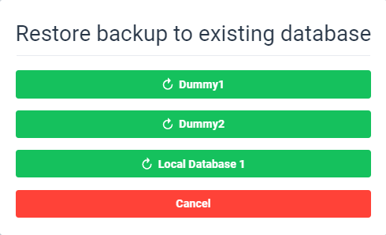

<!-- Main logo for GITHUB -->
<p align="center"></p>

<p align="center">A simple backup solution</p>

# Introduction

Backup Application is a web application created for creating and managing your backups. Currently it supports only MySQL databases.

# Getting Started

## Installation

1. If you're not running this on local machine then create `.env` file. Specify `API_URL` - it defaults to `http://127.0.0.1:5000`. Example `.env` file:

```bash
API_URL=http://192.168.0.10:5000
```

2. Start up the server

```bash
docker-compose up
```

3. Open up a browser and go to `http://localhost:5000`. If you get asked for credentials, here are the default ones:

```bash
user: root
password: IS2017
```

Note: Default port is `5000`. You can change it using `PORT` environmental variable in `.env` file. Remember that if you change default port you have to add it to `ports` section in your docker-compose file!

## Usage


**Backups tab**

This is how the website looks like. It's a screenshot of the main page.

On the left you can see sidebar that acts like main navigation. There are 4 tabs:

- Backups
- Databases
- Users
- Secure Copy

### Backups

The backups tab shows grid with recently made backups. See above screen for reference. The grid shows only 50 recently made backups.

There are two action buttons:

- Download - downloads compressed backup
- Restore - opens up a modal window that let's user to restore given backup to specific database. The user can decide if the backup will be restored to predefinied database or to unknown database (user must provide information of that specific database)

Note: All backups are automatically deleted after 30 days!

#### Restore screenshots





### Databases


**Databases tab**

The grid displays definied databases. Do add a new database you need to provide:

- `name` - a name you want to give for that database
- `host`
- `port`
- `database`
- `user`
- `password`
- `cron` - cron-like string that tells the program to how often backup of that specific database should run
- `active` (bool) - decides if the the backup of this database should be done automatically based on cron

There are three action buttons in the grid:

- Backup - Forces a backup
- Edit - let's user to edit specific database entry
- Delete - deletes database entry

This is a window that let's you add a new database


### Users


**Users tab**

Users' grid displays currently registered users that are allowed to log in to the application via browser prompt when you enter the site. All passwords are hashed in the database. Each user has an api key that allows him to make requests via terminal (curl) or third party application.

To create a user you need to provide only username and password.

User addition modal:


### Secure Copy


**Secure Copy tab**

On this tab user can add "datasources". They represent servers to which backups are sent after they are completed.

In order to add a datasource, user must specify:

- `name` - display name for given datasource
- `host`
- `port`
- `user`
- `password` - this is saved in plain text so a secure user without sudo privileges is recommended!
- `path`
- `active` (bool)

Datasource addition modal:


# Backup notifications

Backup functionality supports user notification via slack or e-mail. To enable them you have to configure their respective environmental variables. More below.

Slack configuration variables:

- `SLACK_WEBOOK`
- `SLACK_CHANNEL` - only needed for **old** web hooks

E-mail configuration variables:

- `SENDER_EMAIL` - e-mail address of the account that sends notifications
- `SENDER_PASSWORD` - password for that e-mail account
- `RECEIVER_EMAIL`- e-mail address of the person who is supposed to get notifications

#### Example .env file with notification variables

```
SLACK_WEBHOOK=https://hooks.slack.com/services/1234LEEK56/0987654ABC/0192837465ABCDEFGH
SLACK_CHANNEL=#notifications
SENDER_EMAIL=im_backup_notificator@gmail.com
SENDER_PASSWORD=password123
RECEIVER_EMAIL=john.doe0913665@gmail.com
```

# Testing

Right now this application is tested only with end-to-end tests.

For more info check `tests` directory.

# Sample databases

In `.mysql` folder there are two sample databases ready for you to test our application. All you need to do is create `.env` file with root passwords for those databases and launch them with `docker-compose -f docker-compose.db.yml up -d` command.

Example `.env` file with db passwords:

```bash
DUMMY_PASSWORD_1=test123
DUMMY_PASSWORD_2=123test
```
